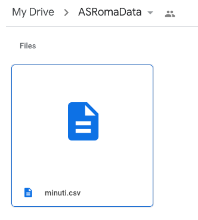
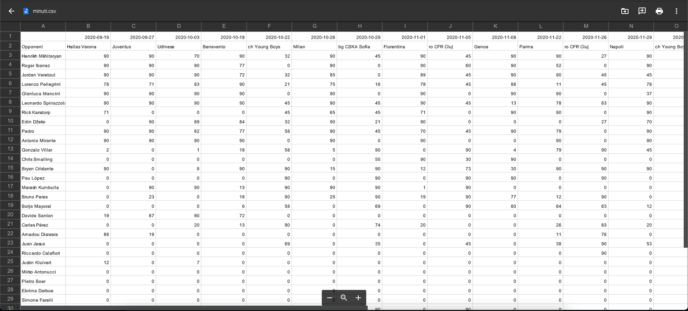

# Google Drive - .csv file upload

Season summary application, scraping information to get data on minutes each player has played.
Current version is created for ASRoma, however with some changes in the code, it could be working for any of the major teams.

The applicatin uses fbref to collect information. It loops through each players' profile and records the minutes they have played on each game this season.
Once the numbers are downloaded some additional transforming is done to make is easier to read - opponent name and dates are added.

When that's all done, a .csv file is created which is then uploaded to a shared folder on google drive.

